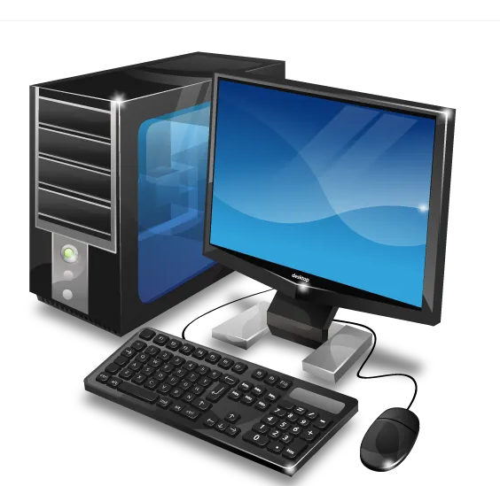

# Introduction to computers
## project description
This project provide basic information about computers, their types, history and importance in life.
## Introduction to computers 
a computer is an electronic devise that accepts data as input, process  it according to instructions and stores information. 
## TYPES OF COMPUTERS
1. **SUPERCOMPUTER**
2. **MAINFRAME**
3. **MINICOMPUTERS**
4. **MICROCOMPUTERS**
## COPMUTER TYPES TABLE
| TYPE | EXAMPLE |
| ---|--- |
|SUPER COMPUTER | RESEARCH |
| MAINFRAME | BANKING |
| MICROCOPMUTER | LAPTOP |
### EXAMPLE
'COMPUTER'
*computers are important in todays world.*
## History of somputers
- first generation
- second generation
- third generation
- fourth generation
- modern computers
## tools used 
- git
- github
- markdown
## project workflow
1. create repository
2. create branch
3. add project content
4. make commits
5. create pull request
6. review pull request
7. review and merge
## project tasks
- [x] create repo.
- [x] create branch
- [x] add project content
- [x] make 3 commits
- [ ] create pull request
- [ ] review pull reqyest
- [ ] merge pull request 
## link
[GitHub](http//github.com/)
## student information 
- **name : syed Muhammad Taha Haider
- **roll number:** 26K-3118
- **section:** SE-1D

  
